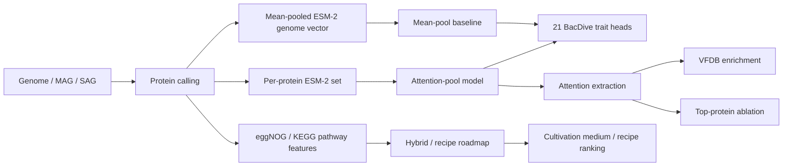
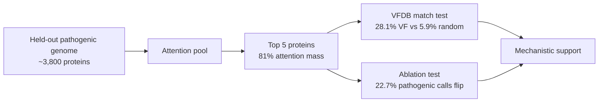

# microbe-foundation

**Reading the genome of an organism no one has ever grown, and predicting how to grow it.**

Most microbial life is *dark matter*: an estimated **99% of microbial species have never been cultured** in a lab, so we know almost nothing about them — what they need to grow, what they do, or what they could make. Yet their genomes are pouring in by the millions (metagenome-assembled and single-cell genomes). microbe-foundation is a machine-learning effort to **turn those genomes into actionable biology**: predict an organism's complete species description *and* the cultivation conditions likely to bring it into culture, so labs can prioritize the few worth attempting instead of blindly trying thousands.

> **One line:** a genome-conditioned, multi-task model that predicts a microbe's traits and its likely **cultivation medium**, used as a screening tool to triage which dark-matter organisms to try to culture — with a roadmap toward a closed active-learning loop that gets better with every wet-lab result.

**Status:** work-in-progress research. The benchmark, schema, multi-task model, **per-protein attention-pool encoder**, and **mechanistic interpretability pipeline** are reproducible end-to-end today. The hybrid features, generative recipe head, and active-learning loop are planned — clearly marked throughout (✅ built · 🚧 in progress · 📋 planned).

> **Headline result (2026-06):** the predictability gradient is real and seed-validated. Attention-pooling over per-protein ESM-2 embeddings helps **machinery traits ~4× more than compositional traits** (species split gap +0.062 Δf1, std ≤0.011), and the advantage **collapses under family-level covariate shift**. For pathogenicity, the attention provably **finds the virulence factors**: top-attended proteins are 5× enriched for VFDB virulence genes vs random (p=2.5×10⁻⁷), and removing 5 of ~3,800 proteins flips 23% of pathogenic calls. See [Results](#results-what-the-per-protein-attention-model-showed).

---

## Try it / read it

| Artifact | Link | Purpose |
|---|---|---|
| **Public dashboard** | [miyuiu/microbe-foundation](https://miyuiu-microbe-foundation.hf.space) | Paste/upload FASTA, inspect sequence QC, and preview trait + cultivation-medium triage. |
| **Research showcase** | [miyuiu/predictability-gradient](https://miyuiu-predictability-gradient.hf.space) | Interactive companion for the predictability-gradient result, attribution, VFDB enrichment, and ablation. |
| **Clean academic manuscript** | [`paper/predictability_gradient_academic.pdf`](paper/predictability_gradient_academic.pdf) | Professional paper-style PDF for review/sharing. |
| **Manuscript source** | [`paper/predictability_gradient_academic.md`](paper/predictability_gradient_academic.md) | Editable source for the clean academic manuscript. |

## Visual summary

### System map



### Predictability-gradient result

```mermaid
xychart-beta
    title "Attention gain over mean-pool by trait class"
    x-axis ["species", "genus", "family"]
    y-axis "Delta F1" 0 --> 0.09
    bar "Compositional" [0.021, 0.016, 0.009]
    bar "Machinery" [0.083, 0.067, 0.010]
```



The chart above is the core scientific result: attention helps most when the trait is decided by a small number of genes, and the advantage disappears when the test clade is too far from training.

### Pathogenicity attribution result



| Evidence type | Result | Interpretation |
|---|---:|---|
| Attention concentration | Top-5 proteins carry **81%** of attention | The model is selecting a small genomic subset, not averaging diffusely. |
| Within-genome VFDB enrichment | **28.1%** VF vs **5.9%** random, p = **2.5×10⁻⁷** | Top-attended proteins are ~5× enriched for known virulence machinery. |
| Between-class enrichment | OR = **3.2**, p = **6.8×10⁻¹⁴** | The enrichment is stronger in pathogenic than non-pathogenic genomes. |
| Causal ablation | Removing top-5 proteins flips **22.7%** of pathogenic calls | The prediction depends on the selected proteins. |

---

## Why this matters

- **The unculturable 99%.** The vast majority of microbes resist cultivation because we don't know their growth requirements. Locked inside that dark matter is most of nature's undiscovered antibiotics, enzymes, and metabolic chemistry.
- **Cultivation is blind and expensive.** Today, bringing a new organism into culture is trial-and-error over a huge space of media and conditions. A model that *ranks candidates and proposes a recipe* converts a blind search into a prioritized shortlist.
- **The genomes already exist.** We don't lack sequence — we lack the map from sequence → phenotype → cultivation conditions for organisms unlike anything previously characterized. That map is the ML problem.

## What it does

1. **Predicts the full species description from genome** — morphology, physiology, growth conditions, cultivation media, biosafety, ecology, and chemotaxonomy (21 prediction heads; see below). ✅
2. **Predicts cultivation requirements** — the medium an organism is likely to grow in, framed as a screening/ranking problem with calibrated confidence rather than a single point guess. ✅ (medium-as-class today) · 📋 (medium-as-recipe next)
3. **(Roadmap) Proposes novel recipes for novel organisms** — a generative recipe head that composes media (ingredients + concentrations) for genomes unlike anything in training, grounded in genome-derived auxotrophy signals. 📋
4. **(Roadmap) Improves itself from experiments** — a Bayesian-optimization / active-learning loop where each wet-lab result is a new label that shrinks the gap between "organisms we could culture" and "organisms we couldn't." 📋

## The scientific thesis: a predictability gradient

Not all traits are predicted the same way. The spine of the modeling work — **now tested and confirmed** — is that traits live on a **predictability gradient**:

- **Compositional traits** (GC-correlated properties, bulk membrane/cell-wall features) are diffuse signals spread across the whole genome → **mean-pooling** the protein representations is sufficient.
- **Machinery traits** (motility, specific metabolic capabilities, pathogenicity, *nutrient requirements*) are decided by a handful of decisive genes → **attention-pooling** wins, because averaging dilutes the signal.

Cultivation requirements sit at the *machinery* end: an organism's need for an exogenous amino acid is determined by whether ~8 specific biosynthesis genes are present or absent, not by a genome-wide average. The encoder therefore moves from mean-pool to **per-protein + attention pooling**, and — critically — the gradient is *directly testable inside one architecture* by swapping the pooling. We ran that test. ✅

---

## Results: what the per-protein attention model showed

Trained the 21-head model on **per-protein ESM-2 embeddings** (640-dim, `esm2_t30_150M`, learned attention pooling) vs the **mean-pool** baseline, across three taxonomic holdouts, **3 seeds each**. All numbers are Δf1 = (attention-pool − mean-pool), mean ± std across seeds.

### 1. The predictability gradient is real (seed-validated)

| Split | Compositional Δf1 | Machinery Δf1 | Gap (mach − comp) |
|---|---|---|---|
| **species** | +0.021 ± 0.002 | **+0.083 ± 0.012** | **+0.062** |
| **genus** | +0.016 ± 0.004 | **+0.067 ± 0.010** | **+0.052** |
| **family** (covariate shift) | +0.009 ± 0.002 | +0.010 ± 0.003 | **+0.001** |

- Attention helps **machinery traits ~4× more** than compositional traits (species/genus), with **non-overlapping error bars** — a real effect, not seed noise.
- **Compositional traits confirm the null:** at the family split, attention adds ~nothing (Δf1 ≈ 0) — mean-pool is already sufficient, exactly as predicted.
- **Covariate shift is the wall:** the machinery advantage collapses from +0.062 (species) → +0.001 (family). The harder the evolutionary gap, the smaller attention's edge.

(`compositional` = gram stain, cell shape, motility, sporulation, oxygen, catalase, oxidase, temperature, pH, halophily, pigmentation. `machinery` = pathogenicity ×2, cultivation medium, carbon utilization, metabolite production, AMR, biosafety, FAME.)

### 2. The attention finds the responsible genes (pathogenicity case study)

A 4-phase interpretability analysis on `pathogenicity_animal`/`pathogenicity_human` (single-task attention-pool models, species split, AUROC 0.88/0.85):

| Phase | Question | Finding |
|---|---|---|
| **Concentrate** | does attention focus? | **top-5 proteins carry 81% of attention** (of ~3,800), entropy 0.26 |
| **Enrich (within-genome)** | are top-attended proteins virulence factors vs *random proteins in the same genome*? | **28.1% VF vs 5.9%** — Wilcoxon **p = 2.5×10⁻⁷** (~5×) |
| **Enrich (vs non-pathogenic)** | more so when the trait is present? | 28.1% vs 10.9% — Fisher **OR = 3.2, p = 6.8×10⁻¹⁴** |
| **Ablate (causal)** | does the prediction depend on them? | removing top-5 (of ~3,800) **flips 22.7% of pathogenic calls** (p = 1.2×10⁻⁴); random removal ≈ 0 |

Both controls and the ablation **replicate on the human head** (OR = 3.1, p = 3.8×10⁻⁵; 12.5% flip). The spotlighted virulence factors are **coherent machinery** — fimbrial ushers (`papC`, `mrkC`), filamentous hemagglutinin (`fhaB`), invasion locus (`ail`), type IV pili (`pilQ`), flagellar genes (`fliR`) — adherence and invasion, not VFDB noise.

**One-line conclusion:** keeping proteins un-pooled and learning *which* to weight predicts gene-determined ("machinery") phenotypes more accurately — by spotlighting the genes responsible — but only for organisms within taxonomic range of training.

### Honest limitations

- **Covariate shift unsolved.** The gain vanishes at family-level holdout; cross-family generalization (the cultured→uncultured shift) remains the open frontier.
- **Weighted sum, not combinations.** Attention-pooling up-weights individual proteins; it does not model protein–protein *interactions*. "Gene A together with gene B" is a future architecture, not this one.
- **Enrichment, not coverage.** 68% of top-attended proteins are *not* VFDB hits — expected, since VFDB only catalogs *known* virulence factors. The claim is the enrichment, never "all top proteins are VFs."
- **Ablation is partly mechanical.** Attention pooling is a weighted sum, so removing high-weight proteins changes it more by construction; the load-bearing facts are the *absolute* flip rate (23%) + the VFDB enrichment, not the top-vs-random ratio alone.
- **Single encoder size.** All results use `esm2_t30_150M` (640-dim); whether a larger ESM-2 sharpens the gradient is untested.

---

## What it predicts

**21 prediction heads** across 7 biological blocks. See `paper/tables/01_trait_inventory.md` for the full inventory regenerated from `trait_schema.json`.

| Block | Heads |
|---|---|
| Morphology | gram stain, cell shape, motility, sporulation, pigmentation |
| Physiology | oxygen tolerance, catalase, cytochrome oxidase, halophily |
| Growth conditions | temperature class, pH class |
| Cultivation | cultivation medium (MediaDive-linked), carbon utilization, metabolite production, AMR phenotype |
| Safety | biosafety level, pathogenicity (human), pathogenicity (animal) |
| Ecology | isolation source, country of isolation |
| Chemotaxonomy | fatty-acid profile (FAME) — **first genome-to-FAME predictor in the literature** |

## Contributions (what's defensible today)

| | Contribution | Why it's defensible |
|---|---|---|
| 1 | **Full BacDive species-description coverage.** 21 heads across all 7 biological blocks. | MicroGenomer covers ecophysiology only; BacBench has no chemotaxonomy / medium / pathogenicity; BacPT targets metabolic/ecological. None match scope. |
| 2 | **First chemotaxonomy-from-genome predictor (FAME).** | Live literature search (2026-05-28) confirmed zero prior papers. |
| 3 | **Family-held-out splits.** Strictly harder than BacBench's genus-only splits. | Tests cross-family generalization, not within-family memorization — a proxy for the cultured→uncultured shift. |
| 4 | **Masked multi-task loss** over BacDive's heavily sparse labels (5–95% coverage per head). | None of the three foundation-model competitors explicitly handles label sparsity this way. |
| 5 | **Seed-validated predictability gradient + mechanistic interpretability.** Attention-pool beats mean-pool on machinery traits ~4× more than compositional (gap +0.062, std ≤0.011); for pathogenicity the attention is shown to land on VFDB virulence factors (5×, p=2.5×10⁻⁷) and the prediction causally depends on them (23% flip on ablation). | Competitors report benchmark accuracy; none ties an architectural choice to a *testable trait-class hypothesis* and validates it mechanistically against a virulence-factor database. See [Results](#results-what-the-per-protein-attention-model-showed). |

---

## How it works (the process)

### 1. Data — labels from the cultured minority

```
BacDive REST API  --> data/bacdive_raw.jsonl          (fetch_bacdive.py)        ✅
                  --> data/traits.parquet              (parse_bacdive.py)         ✅
                  --> data/splits.parquet              (splits.py, family-held-out)✅
                  --> data/vocabularies.json           (vocab.py)                 ✅
                  --> data/genome_accessions.tsv       (extract_genome_accessions.py) ✅
MediaDive         --> cultivation-medium recipes joined to BacDive strains       ✅
```

BacDive provides measured traits for the cultured minority; MediaDive provides the medium each strain grows in. These are the supervision for genome → trait and genome → medium.

### 2. Features — two complementary views of a genome

A genome enters as its set of proteins (predicted with pyrodigal), then is encoded two ways that are designed to be **fused**:

```
proteins --> ESM-2 mean-pool per genome          (compute_esm2_features.py)        ✅ baseline
         --> ESM-2 per-protein embeddings         (modal_esm2_perprotein.py,         ✅ 19,592 genomes,
                                                    compute_esm2_perprotein_mp.py,       82M proteins, ~105 GB
                                                    embed_from_cache.py)                 (on S3, see Data & artifacts)
         --> eggNOG / KEGG pathway-completeness    (compute_eggnog_features.py,       ✅
                                                    modal_eggnog.py)
```

The **per-protein set is complete**: every BacDive genome's full proteome embedded individually as a `[n_proteins, 640]` fp16 matrix (no pooling), extracted on Modal + multi-GPU Lambda boxes and archived to S3. This is what the attention-pool encoder consumes — and what made the interpretability analysis possible.

- **Per-protein ESM-2 embeddings** capture *novel, unannotated* proteins — the dark-matter case where annotation fails.
- **eggNOG / KEGG pathway-completeness** gives a *clean auxotrophy signal* — "is the lysine-biosynthesis module complete?" maps almost directly to "does the medium need lysine?"

The two views are complementary: embeddings see what annotation misses; annotation grounds what embeddings can't easily express.

### 3. Model — multi-task, moving toward a cross-attentive recipe decoder

```
model.py  --> 21-head multi-task model + masked loss (mean-pool features)         ✅
          --> attention pooling over per-protein embeddings (--per-protein)        ✅ validated, see Results
          --> per-protein interpretability (extract / VFDB enrich / ablate)        ✅
          --> hybrid encoder: ESM-2 protein tokens + eggNOG pathway tokens         📋
          --> generative recipe head (ingredients + concentrations)                📋
```

**Attention pooling (`model.py --per-protein`)** learns a scalar weight per protein (masked softmax over the proteome) and outputs a weighted-sum genome vector, instead of a flat mean. `AttentionPool.store_attn` exposes those weights for interpretation. The three interpretability scripts — `extract_attention.py` (dump per-protein attention), `vfdb_enrichment.py` (are top-attended proteins virulence factors?), `ablate_attention.py` (does the prediction depend on them?) — form the analysis behind [Results §2](#2-the-attention-finds-the-responsible-genes-pathogenicity-case-study).

**Planned architecture (design captured in `docs/`):** a Set-Transformer / Perceiver genome encoder over frozen per-protein ESM-2 embeddings *and* eggNOG pathway tokens, with **ingredient queries that cross-attend to the protein/pathway set** — so each predicted ingredient is justified by the specific genes that imply it (interpretable, auxotrophy-grounded). A parallel mean-pool path serves compositional traits, making the predictability gradient testable in one model.

### 4. Evaluation — screening-shaped, not accuracy-shaped

The deliverable is a *ranked, calibrated shortlist*, so the metrics are precision@k / cultivation-attempts-saved and **calibration under phylogenetic shift**, not raw accuracy. The model must beat three honest baselines under a strict family/clade holdout:

1. **16S nearest-neighbor** ("copy the medium of the closest cultured relative") — a deceptively strong baseline.
2. **Genome-scale metabolic model** (gapseq / CarveMe + flux-balance analysis) — the established mechanistic approach.
3. **eggNOG-only logistic regression** — to prove the learned ESM-2 representation adds value over gene-content alone.

### 5. (Roadmap) The active-learning loop — a self-improving culturomics engine 📋

Framed as **Bayesian optimization**, not RL-against-a-simulator:

- **Surrogate** = the genome-conditioned model with calibrated uncertainty (deep ensemble), scoring `(genome, medium) → P(growth) ± σ`.
- **Acquisition function** = ranks candidate experiments by `P(growth) × information-gain × novelty` to choose what to try next.
- **Oracle** = the wet lab (ground truth). Optionally a **multi-fidelity** setup uses cheap in-silico FBA as a low-fidelity pre-filter and reserves wet-lab budget for confirmation — dry lab as a prior, never as truth.
- **Flywheel** = each result becomes a new label, progressively closing the cultured→uncultured covariate gap.

---

## Reproduce (what runs today)

### Requirements

- Python 3.11+ recommended (3.9 works for everything except ESM-2 feature extraction)
- Genomes stream from NCBI in memory — no large local genome store required
- GPU recommended for ESM-2 feature extraction and attention-pool training at scale; CPU works for the smallest ESM-2 (8M params) and for the whole interpretability pipeline
- **For the per-protein attention path:** `aws` CLI + a read key for the S3 feature set (105 GB); a `transformers` in `4.40 ≤ v < 4.58` (pinned in `requirements.txt`)
- **For interpretability:** `diamond` ≥2.x, `scipy`, the Modal CLI (protein sequences), and a VFDB download — all CPU, runnable on a laptop

### One-command run

```bash
git clone https://github.com/miyu-horiuchi/microbe-foundation
cd microbe-foundation
pip install -r requirements.txt
bash scripts/run_all.sh                                  # full pipeline
bash scripts/run_all.sh --smoke                          # smoke test (~1000 strains)
```

### Step-by-step

```bash
# 1. Build benchmark
python fetch_bacdive.py                                  # ~2–3 hours, resumable
python parse_bacdive.py                                  # ~30 s
python splits.py                                         # ~2 s
python vocab.py                                          # ~5 s
python extract_genome_accessions.py                      # ~5 s

# 2. Compute features (GPU recommended)
python compute_esm2_features.py \
    --model facebook/esm2_t30_150M_UR50D \
    --sample-n 50 --batch-size 16                        # mean-pool baseline
python compute_eggnog_features.py                        # pathway-completeness view
# per-protein extraction (large GPU jobs): see modal_esm2_perprotein.py
#   and docs/RUNNING_PERPROTEIN_ON_LAMBDA.md

# 3a. Train + evaluate — mean-pool baseline
python model.py \
    --features data/esm2_features.npz \
    --split-level family --epochs 30 \
    --save-metrics runs/esm2_150M_family.json \
    --run-name esm2-150M

# 3b. Train + evaluate — per-protein ATTENTION pool (needs the per-protein set)
#     aws s3 sync s3://microbe-foundation-esm2-perprotein/esm2_perprotein/ data/esm2_perprotein/
python model.py \
    --per-protein data/esm2_perprotein \
    --split-level species --epochs 20 --max-proteins 4096 --num-workers 8 \
    --save-metrics runs/attnpool-species.json --run-name esm2-150M-attnpool
python leaderboard.py            # attention-pool vs mean-pool, per head

# 4. Interpretability (CPU; needs a --save-model checkpoint + protein seqs from Modal)
python model.py --per-protein data/esm2_perprotein --split-level species \
    --single-task pathogenicity_animal --epochs 20 --max-proteins 4096 \
    --save-model runs/patho-animal.pt --save-metrics runs/st-patho-animal.json
python extract_attention.py --checkpoint runs/patho-animal.pt \
    --per-protein data/esm2_perprotein --split-level species \
    --head pathogenicity_animal --top-k 30 --out runs/attn-patho-animal.parquet
#   modal volume get microbe-esm2-perprotein "proteins/<bid>.txt.gz" /tmp/prot/   (per genome)
#   curl -sL https://www.mgc.ac.cn/VFs/Down/VFDB_setA_pro.fas.gz | ... ; diamond makedb
python vfdb_enrichment.py --attn runs/attn-patho-animal.parquet \
    --prot-dir /tmp/prot --vfdb-dmnd /tmp/vfdb/vfdb.dmnd --top-k 5 --out runs/vfdb_animal
python ablate_attention.py --checkpoint runs/patho-animal.pt \
    --attn runs/attn-patho-animal.parquet --npy-dir /tmp/npy --head pathogenicity_animal --k 5

# 5. Refresh paper artifacts
python paper/generate_tables.py
python compare_to_priors.py --our runs/esm2_150M_family.json
```

## Data & artifacts (where everything lives)

Large data is **not** in git. The pipeline produces / consumes:

### Cloud — the per-protein feature set (105 GB)

| Artifact | Location | Contents |
|---|---|---|
| **Per-protein ESM-2 embeddings** | `s3://microbe-foundation-esm2-perprotein/esm2_perprotein/` (AWS us-east-1) | 19,592 × `<bacdive_id>.npy` (`[n_proteins, 640]` fp16) + `manifest.parquet`. 82M proteins, ~105 GB. **The input to the attention-pool encoder.** |
| **Protein sequences** | Modal volume `microbe-esm2-perprotein`, `proteins/<bid>.txt.gz` | 19,278 genomes, one AA sequence per line, **ORF order == `.npy` row order == attention index** (the link that makes interpretability possible). |
| ESM-2 weights cache | Modal volume `microbe-hf-cache` | frozen `esm2_t30_150M` weights (download once) |
| eggNOG DB | Modal volume `microbe-eggnog-db` | eggNOG-mapper reference for the pathway-completeness view |

Pull the features to a GPU/CPU box before training:
```bash
aws s3 sync s3://microbe-foundation-esm2-perprotein/esm2_perprotein/ data/esm2_perprotein/
```
Access is via a scoped IAM key (read-only to that bucket). Extraction was run on Modal (`modal_esm2_perprotein.py`, two-phase to dodge NCBI rate limits) and multi-GPU Lambda boxes (`compute_esm2_perprotein_mp.py --shard`, `embed_from_cache.py`); see `docs/RUNNING_PERPROTEIN_ON_LAMBDA.md`.

### Local — labels, splits, baseline features, run outputs

| File | Produced by | Used for |
|---|---|---|
| `data/traits.parquet` | `parse_bacdive.py` | 21-head labels (100,866 strains × 30 cols) |
| `data/splits.parquet` | `splits.py` | species / genus / family holdouts |
| `data/vocabularies.json` | `vocab.py` | per-head class vocabularies |
| `data/esm2_features.npz` | `compute_esm2_features.py` | mean-pool baseline features |
| `data/esm2_perprotein_manifest.parquet` | — | local index of the per-protein set (bacdive_id, n_proteins) |
| `runs/{attnpool,meanpool}-{split}-s{seed}.json` | `model.py --save-metrics` | the gradient result (3 seeds × 3 splits) |
| `runs/<head>-species.pt` | `model.py --save-model` | trained attention-pool checkpoints (for interpretability) |
| `runs/attn-*.parquet` | `extract_attention.py` | per-genome top-attended protein indices + weights |
| `runs/vfdb_*.{tsv,candidates.parquet}` | `vfdb_enrichment.py` | VFDB hits + enrichment calls |

### External — interpretability reference

- **VFDB** (virulence-factor reference): `VFDB_setA_pro` = 4,663 experimentally-verified VFs. Download **over HTTPS** (`https://www.mgc.ac.cn/VFs/Down/VFDB_setA_pro.fas.gz` — plain HTTP returns 0 bytes), then `diamond makedb`.
- **diamond** ≥2.x for blastp (`brew install diamond`); the interpretability phases run on CPU/laptop, no GPU box needed.

## Repository layout

```
microbe-foundation/
├── schema.py + trait_schema.json     # 21-head schema (source of truth)
├── fetch_bacdive.py                  # bulk BacDive fetcher (stdlib, resumable)
├── parse_bacdive.py                  # per-trait extractors
├── splits.py                         # family/genus/species-held-out splits
├── vocab.py                          # data-derived class vocabularies
├── extract_genome_accessions.py      # NCBI accessions per strain
├── compute_esm2_features.py          # ESM-2 mean-pool per genome
├── compute_esm2_perprotein_mp.py     # ESM-2 per-protein (multi-GPU, sharded)
├── modal_esm2_perprotein.py          # per-protein extraction on Modal
├── embed_from_cache.py               # embed Modal-cached proteins on a GPU box
├── compute_eggnog_features.py        # eggNOG / KEGG pathway-completeness
├── modal_eggnog.py                   # eggNOG annotation on Modal
├── compute_bacformer_features.py     # Bacformer alternative (scaffold)
├── model.py                          # multi-task model + masked loss + attention pool (--per-protein)
├── extract_attention.py              # dump per-protein attention from a checkpoint  (interp P2)
├── vfdb_enrichment.py                # top-attended proteins vs VFDB enrichment       (interp P3)
├── ablate_attention.py               # mask top-attended -> does prediction collapse  (interp P4)
├── leaderboard.py                    # aggregate runs/*.json -> per-head leaderboard
├── compare_to_priors.py              # side-by-side vs published priors
├── prior_numbers.json                # curated prior-work scores
├── microbe_model/                    # vendored from microbe-model v0
│   ├── pipeline.py                   #   in-memory NCBI fetch
│   ├── features/                     #   pyrodigal, ESM-2, KEGG, markers
│   └── data/                         #   BacDive, MediaDive clients
├── reference_data/                   # precomputed MediaDive catalogs
├── docs/                             # design notes + GPU runbooks
├── paper/                            # manuscripts + auto-generated tables
│   ├── predictability_gradient_academic.{md,pdf} # clean academic manuscript
│   └── tables/                       # regenerated benchmark/result tables
├── spaces/                           # Hugging Face Space bundles
│   ├── public_tool/                  # public FASTA dashboard
│   └── research_showcase/            # interactive paper companion
├── scripts/run_all.sh                # one-command pipeline
├── RELATED_WORK.md                   # positioning vs prior work
├── BACBENCH_SCOPE.md                 # BacBench competitor analysis
├── BACDIVE_COVERAGE.md               # per-trait label coverage audit
└── CITATION_AUDIT.md                 # citation verification + threat assessment
```

## Where this fits among prior work

Three 2025–2026 preprints (MicroGenomer, Bacformer, BacPT) claimed the foundation-model framing for microbial genomes; this repo is **not** trying to be a better encoder. Two things distinguish it:

1. **The benchmark + chemotaxonomy white-space (built).** A unified 21-head, family-held-out evaluation anyone can run by swapping in their encoder as `features.npz` — including the first genome-to-FAME predictor. See `RELATED_WORK.md`.
2. **The cultivation-screening direction (the vision).** Reframing the foundation model as a tool that *prioritizes which dark-matter organisms to culture and proposes how* — distinct from purely descriptive trait prediction, and from mechanistic metabolic models (which fail exactly where genomes are novel/incomplete).

## Built on

- **[microbe-model v0](https://github.com/miyu-horiuchi/microbe-model)** — the single-task cultivation-medium predictor that established the BacDive + NCBI Datasets + pyrodigal + ESM-2 pipeline. Pipeline modules vendored under `microbe_model/`.
- **[BacDive](https://bacdive.dsmz.de)** — primary label source (CC-BY 4.0, free public REST API).
- **[MediaDive](https://mediadive.dsmz.de)** — cultivation medium recipes joined to BacDive strains.
- **[ESM-2](https://github.com/facebookresearch/esm)** — protein language model (frozen) providing per-protein representations.
- **[eggNOG-mapper](http://eggnog-mapper.embl.de)** — functional annotation / KEGG pathway-completeness.
- **[Bacformer / BacBench](https://github.com/macwiatrak/Bacformer)** — closest peer benchmark; cited as direct comparator.

## Tests

A pytest suite at `tests/` covers schema invariants (21 heads, 7 blocks, FAME head never dropped), parser correctness, split correctness (no group spans buckets, hits target ratios), and model construction (heads match schema, masked loss flows gradients).

```bash
pip install pytest
python -m pytest tests/ -v
```

Run before any PR touching `schema.py`, `parse_bacdive.py`, `splits.py`, or `model.py`. GitHub Actions runs the same suite on every push to main via `.github/workflows/test.yml`.

## License

Code: MIT. Data: BacDive and MediaDive content are CC-BY 4.0 (cite Schober et al. 2025 in any derivative).

## Citation

If you use this benchmark, please cite the eventual paper (current clean manuscript: `paper/predictability_gradient_academic.pdf`). Until then:

```
Horiuchi, M. (2026). microbe-foundation: predicting microbial species
descriptions and cultivation requirements from genome.
https://github.com/miyu-horiuchi/microbe-foundation
```
