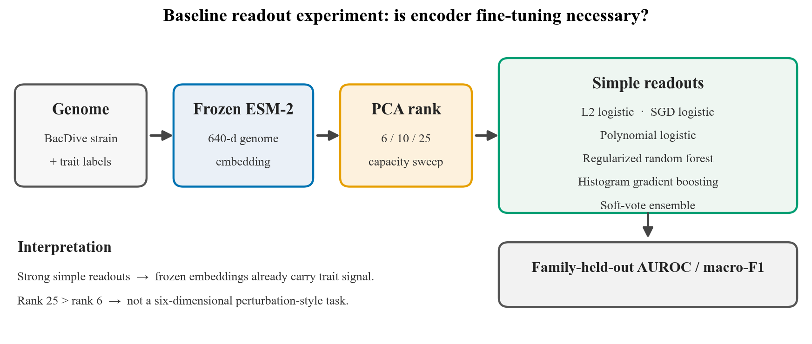
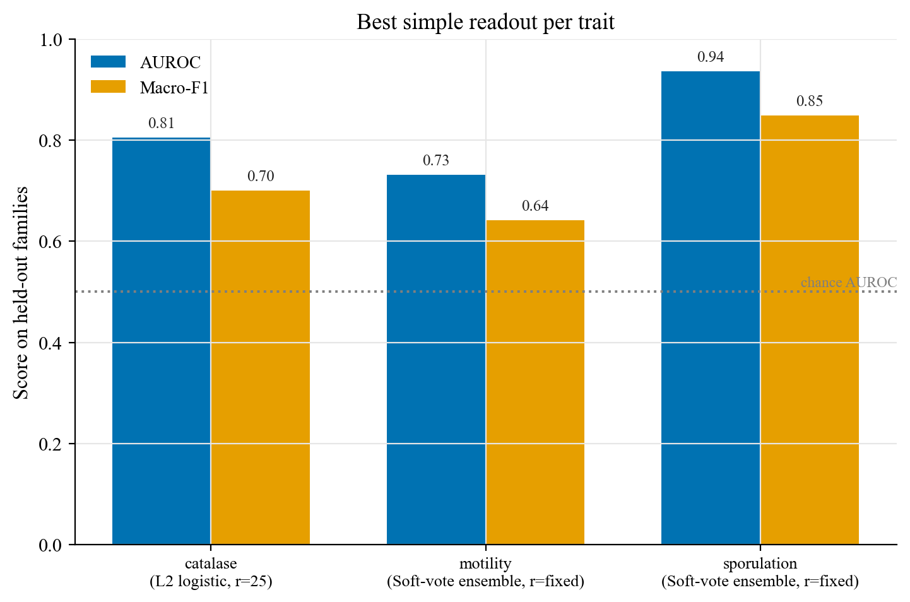
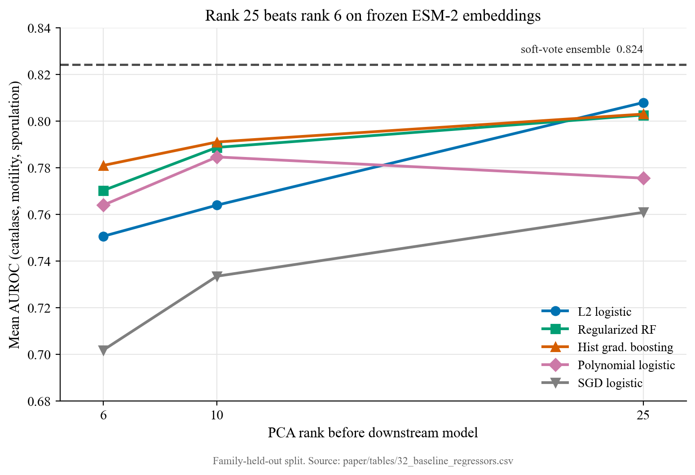
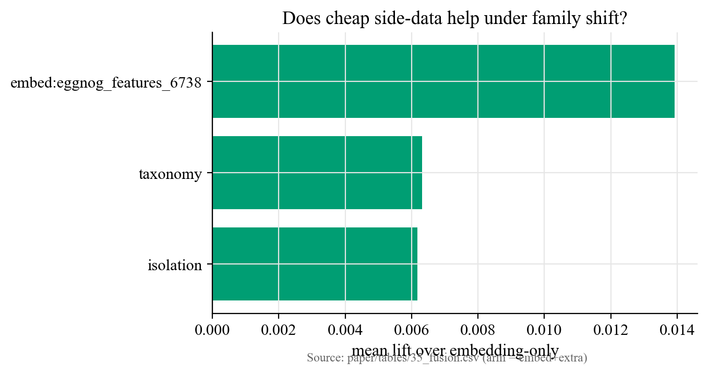

# Introduction

Our previous experiments isolated two architectural levers in microbial genome-to-phenotype prediction. The first asked whether learned pooling over protein embeddings helps compared with mean pooling. The answer was trait-dependent in-distribution, but the advantage collapsed under family-held-out evaluation. The second asked whether adapting ESM-2 with LoRA recovers the lost family-transfer signal. The answer was again negative once imbalanced-label metric artifacts were removed.

A natural critique of both experiments is that they may have skipped an important baseline: **simple downstream models on frozen embeddings**. In many applied biological models, a heavy upstream representation model produces rich features, and a smaller downstream regressor or classifier extracts the task-specific signal. If the embedding already contains the relevant information, then fine-tuning the encoder may add cost and overfitting risk without improving generalization.

This note tests that critique directly. We keep ESM-2 frozen, compress the genome embeddings to several PCA ranks, and fit a family of simple readouts: L2 logistic regression, an SGD-trained logistic classifier, degree-2 polynomial logistic regression, regularized random forest, histogram gradient boosting, and a fixed soft-vote ensemble.

{width=100%}

# Methods

## Data and split

We reuse the existing `data/esm2_features.npz` genome embeddings, `data/traits.parquet` labels, and `data/splits.parquet` family-held-out split. This keeps the readout experiment aligned with the earlier pooling and encoder-adaptation studies. The smoke run reported here evaluates three binary traits:

- `catalase`, a well-supported enzymatic physiology trait.
- `motility`, a cross-clade trait with weaker transfer.
- `sporulation`, a localized machinery trait with strong recoverable signal.

The evaluated family-test sizes are 1,442 for catalase, 1,673 for motility, and 809 for sporulation.

## Model family

All models receive the same frozen ESM-2 genome representation. To test whether the signal is low-dimensional, we apply a PCA bottleneck before the downstream model at ranks 6, 10, and 25. Rank 6 is included because low-rank perturbation benchmarks in single-cell modeling have been criticized for containing only a handful of effective dimensions. Rank 25 tests whether microbial trait signal requires a broader subspace.

The downstream models are:

- **L2 logistic regression:** a regularized linear classifier.
- **SGD logistic:** an elastic-net logistic classifier trained by stochastic gradient descent.
- **Polynomial logistic:** degree-2 feature interactions after PCA.
- **Regularized random forest:** shallow, leaf-regularized tree ensemble.
- **Histogram gradient boosting:** boosted trees with learning-rate and L2 regularization.
- **Soft-vote ensemble:** average probability over representative strong baselines.

We report AUROC and macro-F1. AUROC measures ranking quality independent of a threshold. Macro-F1 measures thresholded classification quality while weighting both classes equally, which is important for imbalanced biological labels.

# Results

## Best model per trait

Simple readouts are not weak controls; they are competitive models.

: Best downstream model on each target.

| Trait | Test n | Test positive rate | Best model | Rank | AUROC | Macro-F1 | AUPRC |
|---|---:|---:|---|---:|---:|---:|---:|
| `catalase` | 1,442 | 0.818 | L2 logistic regression | 25 | 0.805 | 0.700 | 0.933 |
| `motility` | 1,673 | 0.363 | soft-vote ensemble | fixed | 0.731 | 0.641 | 0.592 |
| `sporulation` | 809 | 0.253 | soft-vote ensemble | fixed | 0.936 | 0.848 | 0.861 |

The most striking result is sporulation: a simple ensemble over frozen embeddings reaches AUROC 0.936 and macro-F1 0.848 on held-out families. This means the ESM-2 genome embedding already exposes a strong sporulation signal to lightweight readouts. Motility is weaker but still above chance. Catalase is strongly ranked by logistic regression, though its high positive rate makes macro-F1 the more cautious measure.

{width=85%}

## Model-family comparison

: Mean performance across catalase, motility, and sporulation.

| Model | Rank | Mean macro-F1 | Mean AUROC | Mean AUPRC |
|---|---:|---:|---:|---:|
| soft-vote ensemble | fixed | **0.736** | **0.824** | **0.795** |
| regularized random forest | 25 | 0.724 | 0.803 | 0.765 |
| histogram gradient boosting | 25 | 0.717 | 0.803 | 0.768 |
| L2 logistic regression | 25 | 0.713 | 0.808 | 0.759 |
| polynomial logistic | 25 | 0.698 | 0.776 | 0.726 |
| SGD logistic | 25 | 0.671 | 0.761 | 0.720 |

Three single-model baselines are close: L2 logistic regression, regularized random forest, and histogram gradient boosting. This pattern is informative. The logistic result says much of the signal is almost linearly recoverable from frozen ESM-2. The tree results say there are useful nonlinear interactions, but they do not require a deep downstream architecture. Polynomial logistic models are reasonable but not best, suggesting that "all pairwise interactions" is not the right inductive bias by itself. The SGD classifier is the weakest of the main families, indicating that optimizer choice and regularization details matter even for simple readouts.

{width=100%}

## Rank 25 beats rank 6

The PCA sweep is the key connection to the low-rank-data critique. If these traits behaved like a six-dimensional perturbation dataset, rank 6 would be expected to saturate the simple-model performance. It does not. For L2 logistic regression, mean AUROC rises from 0.751 at rank 6 to 0.808 at rank 25. For regularized random forest, mean AUROC rises from 0.770 to 0.803. For histogram gradient boosting, it rises from 0.781 to 0.803.

This does not prove that the full 640-dimensional embedding is necessary, because the smoke run did not include the full-rank setting. But it does show that the useful microbial trait signal is broader than six principal components, unlike the single-cell perturbation example that motivated the critique.

## A capacity ladder tells you when to stop.

The rank sweep above raises an obvious follow-up: how far should the readout be grown before concluding that a bigger model, or an encoder-level change, is warranted? We formalize this as a capacity ladder and run it on the full default target set (7 binary traits plus the top-5 cultivation-medium one-vs-rest heads, 12 targets total): L2 logistic regression at PCA rank 6, 10, 25, 50, 100, then full rank, then regularized random forest and histogram gradient boosting at full rank. The rule is: keep climbing the ladder while the primary metric keeps improving by at least EPS=0.005 per rung; once two consecutive rungs fail to clear that bar, call it a plateau. A plateau alone does not mean the readout family is done, it means growing *this* readout family further is not worth it. To decide whether to escalate to a different lever entirely (attention pooling, encoder adaptation, a small transformer head), we compare the plateau value against an independent, unsupervised ceiling: the cosine-kNN AUROC from the Table-33 geometry diagnostic. Escalation is only justified if that ceiling exceeds the plateau by more than MARGIN=0.02; otherwise the bottleneck is coverage in the frozen embedding space, not the readout's capacity.

Table 34 gives the verdict distribution over the 12 targets: 2 are `NO — coverage-limited` (catalase, sporulation), 1 is `keep-scaling-simple` (motility), and 9 are `unknown` because the Table-33 cosine-kNN ceiling was only computed for the three traits studied in that diagnostic (catalase, motility, sporulation) and is not yet available for the other binary traits or the cultivation-medium heads. Restricted to the three targets where the ceiling exists, the dominant verdict is coverage-limited, not capacity-limited. For catalase, the ladder plateaus at AUROC 0.816, already above the Table-33 kNN ceiling of 0.764 (`ceiling − plateau = −0.052`); for sporulation, the ladder plateaus at 0.933 against a ceiling of 0.924 (`ceiling − plateau = −0.009`). In both cases the supervised readout has already matched or exceeded what pure geometric nearest-neighbor transfer can support in this embedding, so no amount of additional readout capacity should be expected to move these two traits further; this is exactly the coverage/geometry-limited signature Table 33 assigns catalase directly (rho(cos, error) = −0.107) and the mixed/weak-but-still-limiting link it reports for sporulation. It is also the same diagnosis told twice already in this project: attention pooling and LoRA encoder adaptation were both tried as capacity escalations on these traits under family shift, and neither improved generalization, because the constraint was never model class. Motility is the one exception worth flagging: its ladder has *not* plateaued (lower bound 0.677 climbing to a running-max 0.738), so by this rule motility is still in the regime where growing the simple-model family further is worth doing before reaching for anything more expensive.

{width=90%}

## Does cheap side-data help under family shift?

A cheaper lever than escalating model capacity is adding side-data the encoder never saw: coarse taxonomy (phylum/class/order), sequence-independent isolation metadata (isolation source, country), and a second, independently trained embedding (eggNOG functional-annotation features, PCA-reduced to 50 components). We concatenate each source onto the frozen ESM-2 embedding, fit the extra-data encoders on the training split only (unseen test categories map to zero), and average the resulting lift (embed+extra minus embed-only primary metric) over the L2-logistic/RF/hist-GB model set and all 12 targets. Table 35 reports positive mean lift for all three sources: isolation +0.006, taxonomy +0.006, and the eggNOG second embedding +0.014, more than double either metadata source.

The taxonomy number needs a caveat, which Table 35's own header states directly: taxonomy raising clade-confounded traits is not a clean generalization gain. The per-target breakdown behind that average mean shows why. The largest taxonomy lifts land on the cultivation-medium targets, whose labels are strongly associated with which family a genome belongs to (cultivation_medium:92 +0.036, cultivation_medium:693 +0.021, cultivation_medium:514 +0.013), while pathogenicity_animal and pathogenicity_human, two traits already flagged elsewhere in this project as clade-confounded, see taxonomy lift turn *negative* (−0.019 and −0.004 respectively). The family-held-out split cannot literally leak the identity of a held-out family through a taxonomy one-hot, but coarse taxonomy still acts as a proxy for the training-clade structure a coverage-limited trait depends on, so a positive average taxonomy lift should not be read as newly recovered biological signal; it is at least partly an artifact of exactly the variable the split is designed to hold out. Isolation metadata is the cleanest of the three sources in this respect, being both sequence- and taxonomy-independent, and it still nets a small positive lift, mostly from hist-GB. The eggNOG second embedding gives the largest and most source-agnostic lift of the three, consistent with it being an independently trained functional representation rather than a taxonomy proxy (see also the Limitations note on how its PCA basis is fit).

{width=70%}

## Learned stacking vs a fixed vote.

The Results section above used a fixed soft-vote ensemble as the strongest single readout. Table 36 asks whether a *learned* combiner does better, using the same five Table-32 base learners (L2 logistic rank 25, SGD logistic rank 25, degree-2 polynomial logistic rank 10, regularized random forest rank 25, histogram gradient boosting rank 25). The meta-learner is a balanced logistic regression trained on out-of-fold base-model predictions generated with 5-fold `GroupKFold` on `family`, so no base-model prediction used to train the meta-learner comes from a fold that also trained on that genome's family — the same leakage-safe, family-disjoint protocol used everywhere else in this study.

Averaged across the 12 targets in Table 36, the fixed soft-vote scores mean 0.550 and the learned stack scores mean 0.553, a difference of about +0.004: not a meaningful average win. Target by target, the record is split exactly evenly, the learned stack beats the soft vote on 6 of 12 targets and loses on the other 6. The single largest movement in either direction is a stack win on pigmentation (soft-vote 0.506 vs learned-stack 0.579, +0.073), which is nearly offset by a stack loss on pathogenicity_animal (soft-vote 0.167 vs learned-stack 0.112, −0.055) plus several smaller losses (motility −0.015, sporulation −0.006, cultivation_medium:65 −0.010). Given the single-seed caveat below, this reads as a wash rather than a case for the extra machinery of out-of-fold generation and meta-learner fitting over the parameter-free soft vote — if anything, the soft vote is the safer default, since its worst target-level result is milder than the learned stack's worst.

# Discussion

## What this changes relative to the pooling and LoRA papers

The result sharpens, rather than contradicts, our earlier findings. The pooling study showed that adaptive aggregation helps some traits in-distribution but not under family shift. The LoRA study showed that encoder adaptation does not rescue family transfer and can create metric artifacts on imbalanced heads. This baseline experiment adds a third point:

> Frozen ESM-2 embeddings already contain substantial microbial trait signal, and simple regularized readouts can recover much of it.

Therefore, the failure mode is unlikely to be simply "the model is not big enough" or "the encoder was not fine-tuned." The more plausible bottlenecks are:

- Family-level distribution shift: held-out families differ biologically from training families.
- Label sparsity and noise: BacDive labels are incomplete, biased toward cultured/model organisms, and often not true negatives.
- Trait-specific biology: some traits are localized and recoverable, while others are diffuse, confounded, or under-observed.
- Metric choice: accuracy can reward majority-class collapse on imbalanced labels, so F1/AUPRC must be reported.

## Practical implication

For this project, the next experimental baseline should not be another expensive encoder-adaptation run by default. The more defensible pipeline is:

1. Freeze the genome encoder.
2. Sweep PCA rank and simple regularized readouts.
3. Identify which traits plateau under simple models.
4. Only then escalate to attention pooling, LoRA, or a small transformer head for the traits where simple models fail.

This also makes the paper stronger. It shows that the project is not comparing foundation models against straw-man baselines. It tests the "Pfizer-style" pattern directly: heavy upstream embedding, simple downstream model.

# Limitations

This is a smoke run, not the final benchmark. It covers three binary traits, one encoder (`data/esm2_features.npz`), ranks 6/10/25, and one family-held-out split. The full run should add all binary traits, top cultivation-medium one-vs-rest labels, Bacformer embeddings, full-rank readouts, and multiple seeds where runtime permits. The current result is enough to establish that the baseline family is strong and scientifically necessary; it is not yet enough to claim a universal winner.

The capacity-ladder, fusion, and stacking results (Tables 34-36) share three further caveats. First, single seed: every number above comes from `seed=0`; there are no repeated-seed variance estimates, so small differences (e.g. the +0.004 mean stacking edge) should not be over-read. Second, the taxonomy clade confound: Table 35's positive mean lift for taxonomy is partly earned on traits whose labels are themselves associated with clade membership (the cultivation-medium heads), and it turns negative on the two pathogenicity traits already known to be clade-confounded; a positive taxonomy lift is not, by itself, evidence of new generalizable signal. Third, and specific to the eggNOG second-embedding fusion arm only: its 50-component PCA basis is fit on the pooled (train+test) rows of the eggNOG feature matrix, not on the training split alone. This is unsupervised (no labels are involved) but it is not strictly train-only, so the eggNOG lift in Table 35 carries a mild transductive-fitting caveat that the taxonomy and isolation arms, which are fit on train only, do not share.

# Conclusion

The baseline-regressor experiment validates the critique that simple models should be tried before claiming that encoder adaptation is needed. On frozen ESM-2 genome embeddings, regularized random forest, histogram gradient boosting, and L2 logistic regression at PCA rank 25 are all strong. Polynomial logistic regression is competitive but not best, and the SGD-trained logistic baseline is weaker. Most importantly, rank 25 improves over rank 6, so these microbial trait labels do not appear to be a trivially six-dimensional perturbation-style dataset. The right interpretation is that frozen foundation embeddings already carry useful biological signal; the unsolved problem is making that signal transfer reliably across clades and sparse phenotypic labels.

# Reproducibility

The experiment is implemented in `paper/baseline_regressors.py`. The generated outputs are:

- `paper/tables/32_baseline_regressors.md`
- `paper/tables/32_baseline_regressors.csv`
- `paper/tables/32_baseline_regressors.json`

The smoke-run command was:

```bash
python paper/baseline_regressors.py --targets motility sporulation catalase --ranks 6,10,25 --top-media 0
```

The capacity-ladder, fusion, and stacking diagnostics are implemented in `paper/baseline_capacity_ladder.py`, which reuses the loaders, targets, estimators, and metrics from `paper/baseline_regressors.py` and additionally reads the Table-33 cosine-kNN ceilings (`paper/tables/33_cosine_family_collapse_summary.csv`). It runs CPU-only at a single seed over the full default target set (7 binary traits plus the top-5 cultivation-medium heads, plus the eggNOG second-embedding fusion arm):

```bash
python paper/baseline_capacity_ladder.py
```

Generated outputs:

- `paper/tables/34_capacity_ladder.md` / `.csv` and `paper/tables/34_capacity_ladder_rungs.csv`
- `paper/tables/35_fusion.md` / `.csv`
- `paper/tables/36_stack.md` / `.csv`
- `paper/figures/capacity_ladder.png` / `.pdf`
- `paper/figures/fusion_lift.png` / `.pdf`

Figures are regenerated with:

```bash
python paper/figures/make_baseline_figures.py
```
