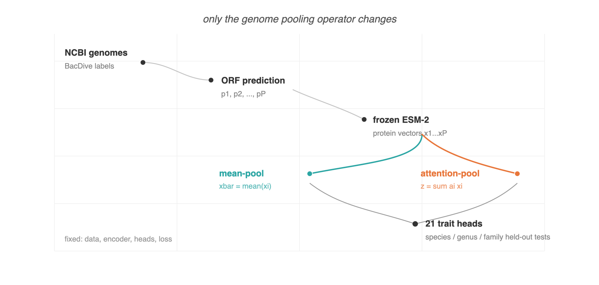
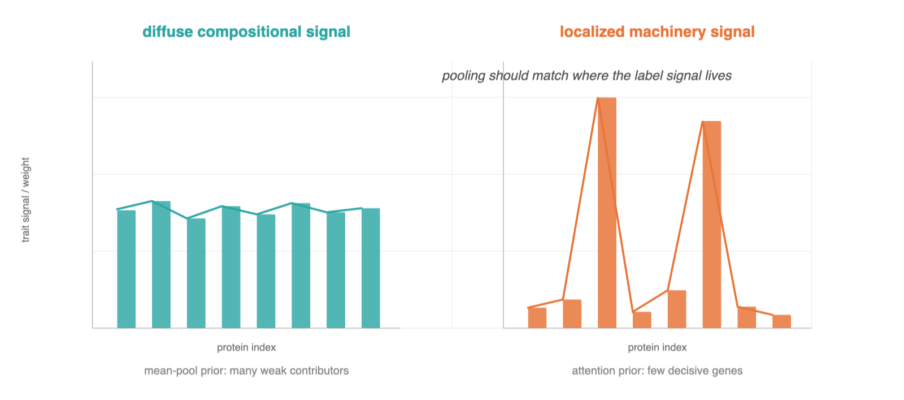
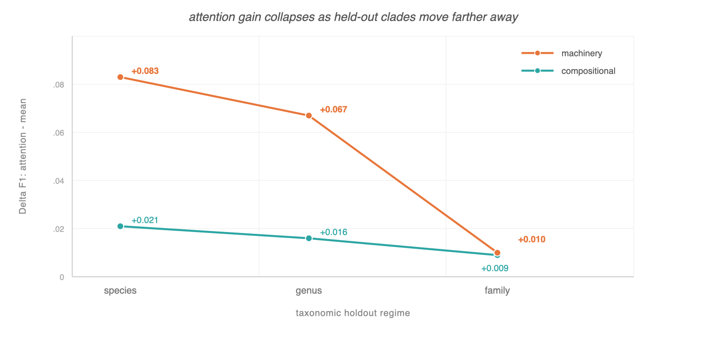
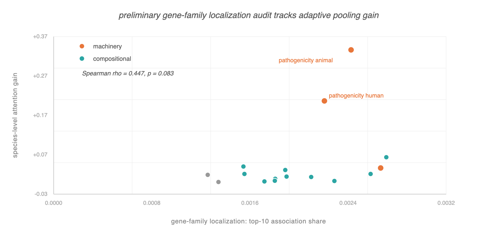
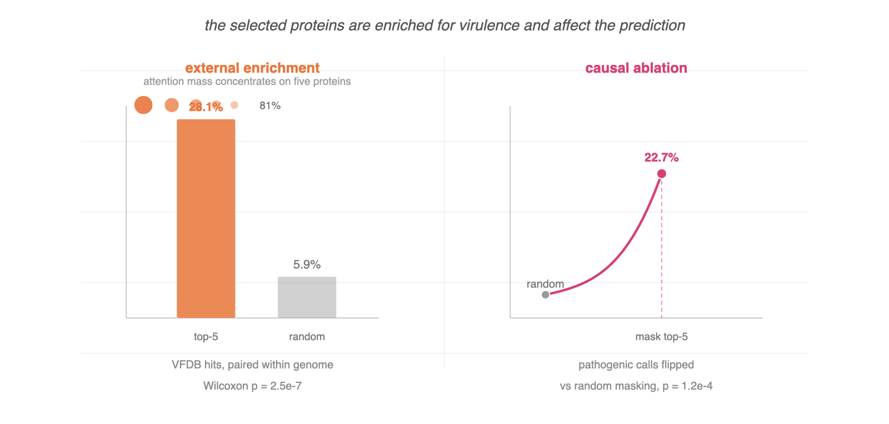

# Introduction

Foundation models for bacterial genomes have advanced rapidly: protein language models such as ESM-2 [@lin2023esm2] produce rich per-protein representations, and recent genome-level models [@wiatrak2025bacformer; @microgenomer2025; @bacpt2026] aggregate them to predict phenotype. A genome, however, is not a sequence but an unordered *set* of $P$ proteins ($P \approx 10^3$--$10^4$), so every such model must **pool** a variable-size set of protein vectors into one genome representation before prediction. This pooling step is almost always chosen by convention, typically a mean, and almost never studied.

This is a missed opportunity, because pooling encodes a strong inductive bias about *where a trait's signal lives in the genome*. Mean-pooling assumes the signal is diffuse: every protein contributes equally. Attention-pooling [@ilse2018attention] assumes the signal is localized: the model learns to up-weight a few decisive proteins. Which bias is correct is not a universal fact; it depends on the trait. Whether a bacterium is Gram-positive is a property of its entire cell envelope; whether it is pathogenic can hinge on a single secretion system.

We formalize this as the **predictability gradient** hypothesis:

> The benefit of attention-pooling over mean-pooling for a trait is proportional to how *localized* that trait's genomic determinants are. Diffuse "compositional" traits gain little; gene-specific "machinery" traits gain much.

This hypothesis is attractive because it is *falsifiable inside a single architecture*: hold the encoder fixed, swap only the pooling, and measure the gain as a function of trait localization. We do exactly this, and add three things a benchmark number cannot provide. First, we vary the **generalization regime** (species-, genus-, family-held-out splits), turning the experiment into a test of whether the gradient survives distribution shift. Second, we add a preliminary **gene-family localization audit** on an eggNOG subset, reducing the risk that the compositional/machinery split is only a hand-labeled story. Third, for the trait with the largest gain, pathogenicity, we ask whether the attention is *mechanistically real*: does it concentrate on virulence machinery, and is the model's prediction intervention-sensitive to removing those proteins? This converts a performance claim ("attention helps") into a scientific one ("attention helps because it finds relevant genes"), while avoiding claims of organism-level biological causality.

**Contributions.**

1. **The predictability-gradient hypothesis and its validation.** A testable account of when set-pooling architecture matters for genomic prediction, confirmed on 19,592 genomes / 21 traits with three seeds: attention helps machinery traits ~4x more than compositional traits, with non-overlapping error bars (§4).
2. **A quantitative localization audit.** On a 6,738-genome eggNOG subset, a scalar-trait gene-family concentration proxy is directionally correlated with species-level attention gain (Spearman $\rho=0.447$, $p=0.083$), supporting but not yet completing the main-track version of the localization claim (§4.2).
3. **A covariate-shift and taxonomy-confounding result.** The gradient is strong within taxonomic distribution and weakens at family level, while a taxonomy-majority baseline reveals that pathogenicity is heavily clade-confounded (§4.3, §4.6). Probing the collapse, we further find it is training-clade-coverage-limited rather than a representation wall, and a label-free retrieval blend recovers a small but consistent part of the lost cross-clade transfer without fine-tuning (§4.5).
4. **Mechanistic attribution against a virulence-factor database.** For pathogenicity, attention concentrates (81% mass on 5 of ~3,800 proteins) and is enriched for VFDB virulence factors under two controls; masking shows model dependence on those proteins; the hits are coherent adherence/invasion machinery (§5).
5. **An evaluation protocol for trait-localization hypotheses.** The paper defines a compact, reusable experimental pattern for testing whether architectural changes help because the relevant phenotype is diffuse, localized, taxonomically confounded, or shifted out of distribution.

We are explicit about what this is *not*: not a new encoder (we freeze ESM-2), not a state-of-the-art benchmark sweep, and not a solution to cross-clade generalization, which our own results show is the open problem.

{width=100%}

# Related Work

**Genomic and protein foundation models.** ESM-2 [@lin2023esm2] provides the frozen per-protein embeddings we pool. Genome-level models, Bacformer [@wiatrak2025bacformer], MicroGenomer [@microgenomer2025], and BacPT [@bacpt2026], aggregate protein or gene representations for phenotype prediction but report benchmark accuracy without analyzing the pooling step or attributing predictions to specific genes. Our contribution is orthogonal and complementary: we hold the encoder fixed and study the aggregation choice and its mechanism.

**Microbial trait prediction.** Classical predictors (Traitar [@weimann2016traitar], Genome Properties [@richardson2019genomeprops], PathogenFinder [@cosentino2013pathogenfinder]) use hand-engineered gene-content features and per-trait classifiers; curated random-forest baselines on BacDive traits remain strong [@koblitz2025traits]. These methods implicitly assume localized, gene-presence signal, consistent with our "machinery" pole, but do not contrast it against a diffuse-signal baseline or quantify when the assumption pays off.

**Attention as explanation.** A literature cautions that attention weights are not, on their own, faithful explanations [@jain2019attention; @wiegreffe2019attention]. We take this seriously: our mechanistic claim does not rest on attention magnitudes but on (i) *external* validation against a curated virulence-factor database [@liu2022vfdb] under matched controls and (ii) intervention masking. We flag where masking is partly mechanical (§5.3, §6).

**Set learning.** Attention-pooling over instances is standard in multiple-instance learning [@ilse2018attention], and permutation-invariant set attention is formalized by the Set Transformer [@lee2019settransformer]. Our novelty is not the existence of attention over sets but tying its benefit to a measurable property of the label (trait localization) and validating the learned attention against ground-truth biology.

# Setup

## Data

Labels are drawn from BacDive [@schober2025bacdive], yielding **21 prediction heads** across seven biological blocks (morphology, physiology, growth conditions, cultivation, safety, ecology, chemotaxonomy). For each strain with an NCBI genome we predict open reading frames with pyrodigal [@larralde2022pyrodigal] and embed each protein independently with a frozen ESM-2 encoder, producing a ragged protein-representation set per genome. A mean-pooled baseline feature is computed from the same protein representations, isolating pooling as the only experimental variable. The training corpus contains 19,592 genomes and approximately 82M protein representations.

This manuscript describes the scientific evaluation; the repository contains the split definitions, run summaries, generated audit tables, and scripts used for the analyses reported below.

## Trait taxonomy: compositional vs machinery

We pre-register a partition of the 21 heads into **compositional** (signal expected diffuse) and **machinery** (signal expected gene-localized), from biological first principles and *before* seeing pooling results:

- **Compositional (11):** gram stain, cell shape, motility, sporulation, oxygen tolerance, catalase, cytochrome oxidase, temperature class, pH class, halophily, pigmentation.
- **Machinery (8):** pathogenicity (human), pathogenicity (animal), cultivation medium, carbon utilization, metabolite production, antimicrobial-resistance phenotype, biosafety level, fatty-acid (FAME) profile.

Two metadata heads (isolation source, country) are excluded from the gradient analysis as they are not biological traits.

Because the hand partition is a potential reviewer concern, we also compute a preliminary **gene-family localization proxy** on the available eggNOG audit subset (`data/eggnog_features_6738.npz`, 6,738 genomes $\times$ 24,854 orthologous groups). For each scalar trait, we compute a supervised gene-family association vector from class-conditional feature-rate differences, then summarize how concentrated that vector is. The main proxy, `top10_share`, is the fraction of association mass carried by the ten strongest gene families; `n80` is the number of gene families needed to reach 80% of association mass. This audit excludes multilabel and regression-vector heads, so it is not a substitute for the full main-track experiment, but it makes the localization hypothesis measurable rather than purely categorical.

## Model

A shared MLP encoder feeds 21 linear heads under a **masked multi-task loss** that contributes zero gradient for missing labels (BacDive coverage ranges 5--95% per head). The only architectural variable in this experiment is the pooling:

- **Mean-pool:** genome vector $\bar{x} = \frac{1}{P}\sum_i x_i$.
- **Attention-pool:** a learned scalar scorer produces a masked softmax over real proteins and a weighted-sum genome vector.

Both share encoder, heads, and loss; only pooling differs. This deliberately narrow comparison is the reason the result can be interpreted as a pooling effect rather than an encoder effect.

{width=100%}

## Evaluation regimes

We use **species-, genus-, and family-held-out** splits: no species (resp. genus, family) appears in more than one fold. Family-held-out approximates prediction for clades unlike anything seen in training, the regime relevant to uncultured "microbial dark matter." We report macro-F1 per head and, for the gradient, $\Delta\mathrm{F1} = \mathrm{F1}_{\text{attn}} - \mathrm{F1}_{\text{mean}}$, aggregated within trait class, mean $\pm$ std over **3 seeds**.

Absolute per-trait results, including mean-pool score, attention-pool score, standard deviation, and $\Delta$ for all available heads and splits, are generated in `paper/tables/10_pooling_absolute_results.md`. This table is necessary because $\Delta$F1 alone can be misleading when absolute performance is low.

# The Predictability Gradient

## Attention helps machinery traits, not compositional traits

: Gain from attention-pooling over mean-pooling ($\Delta$F1, mean $\pm$ std over 3 seeds).

| Split | Compositional (n=11) | Machinery (n=8) | Gap (mach $-$ comp) |
|:--|:--:|:--:|:--:|
| species | $+0.021 \pm 0.002$ | $\mathbf{+0.083 \pm 0.012}$ | $\mathbf{+0.062}$ |
| genus | $+0.016 \pm 0.004$ | $\mathbf{+0.067 \pm 0.010}$ | $\mathbf{+0.052}$ |
| family | $+0.009 \pm 0.002$ | $+0.010 \pm 0.003$ | $+0.001$ |

At the species and genus levels the machinery gain exceeds the compositional gain by ~4x, with **non-overlapping error bars** ($0.083\pm0.012$ vs $0.021\pm0.002$). The compositional gain is small, positive, and tight; attention does not *hurt* diffuse traits, it simply adds little, exactly as the hypothesis predicts: when signal is genome-wide, a weighted average and a flat average converge. The single largest per-head effects are pathogenicity (animal F1 $0.26\to0.50$, human $0.16\to0.32$ at species), the most gene-localized traits in the set.

{width=100%}

## A preliminary localization audit is directionally consistent

The scalar-trait eggNOG audit gives preliminary quantitative support for the same pattern. The top-10 gene-family association share is positively correlated with species-level attention gain (Spearman $\rho=0.447$, $p=0.083$, $n=16$ scalar traits), and the two pathogenicity heads sit in the high-gain/high-localization region. This is not yet the full NeurIPS/ICML-strength localization result: the audit excludes multilabel heads such as cultivation medium and AMR phenotype, uses a simple class-conditional association score rather than a sparse predictive model, and covers only the available eggNOG subset. Its value is that it turns a subjective biological split into an explicit measurement, and defines the next experiment: repeat this with sparse gene-family predictors for every output label.

{width=100%}

## The gradient collapses under covariate shift

The most consequential result is the family row. As the test distribution moves from same-species to same-family to *novel-family* organisms, the machinery advantage decays monotonically ($+0.083 \to +0.067 \to +0.010$) until the gradient is effectively gone (gap $+0.001$). Mean- and attention-pooling become indistinguishable precisely in the regime that matters for uncultured organisms. This localizes the bottleneck: the limiting factor is not how we pool proteins but whether *any* protein-set representation transfers across evolutionary distance.

## Detecting the covariate-shift regime

If the pooling advantage vanishes precisely for novel-family organisms, a practitioner needs to *know* when a query genome falls in that regime. This is feasible without labels: a monitor over the genome embeddings flags novel-family organisms. Using mean $k$-nearest-neighbour distance from a candidate's 640-d ESM-2 vector to the training-family genomes, held-out *novel families* separate from held-out strains of *seen families* at AUROC 0.76. A curvature-aware diffusion-map variant (a heat-kernel embedding of the reference manifold) does **not** improve on plain Euclidean distance (AUROC 0.69--0.73 across 10--100 diffusion components); the simplest detector is the best one.

Detecting the regime is not the same as triaging individual genomes. We tested whether the same novelty score predicts *per-genome* error, training family-split classifiers per trait and correlating embedding distance with $|y-\hat p|$ on novel families. The relationship is trait-specific and weak: positive only for the most localized, highly-learnable machinery trait (sporulation, Spearman $+0.09$ with the production model; $+0.14$ with a linear probe), null for compositional traits, and *negative* for imbalanced pathogenicity, where genomes far from known pathogens are confidently---and correctly---predicted non-pathogenic. The embedding monitor is therefore a **distribution-shift detector, not a per-genome confidence estimate**: it signals that the model is operating off-distribution, not which individual predictions to distrust.

## Why the collapse happens, and a partial fix

Detection localizes *when* a query is off-distribution but says nothing about *why* cross-clade transfer fails or whether it can be recovered. We probe this directly on the frozen 640-d ESM-2 embeddings with transparent linear probes and a three-way family split (train/val/test families mutually disjoint), for the three binary traits of §4.4 (sporulation, motility, catalase).

First, the representation is not the wall. Predicting a novel-family genome's label from the majority label of its $k$ nearest *training-family* neighbours in embedding space matches a trained probe and clearly beats a training-majority baseline (cross-clade $k$-NN AUROC $0.69$--$0.92$ across the three traits). The 640-d embedding therefore *does* carry trait signal across family boundaries. To ask whether the collapse is instead a matter of *clade coverage*, we vary the number of distinct training families while holding the number of training genomes fixed---a size-controlled ablation that separates "more clades" from "more data". Novel-family transfer still rises with family count at fixed genome budget, so in this setting the bottleneck is training-clade diversity, not a frozen-representation ceiling.

Second, the geometry is partly exploitable without touching the encoder. A convex blend of the probe and the cross-clade $k$-NN, $\alpha\,p_{\text{probe}} + (1-\alpha)\,p_{k\text{NN}}$ with $\alpha$ tuned on family-val and evaluated once on family-test, beats probe-alone on every trait, on both macro-F1 and the threshold-free AUROC, at a consistent $\alpha^\star = 0.4$ (sporulation $+0.018$ F1 / $+0.010$ AUROC; motility $+0.020$ / $+0.025$; catalase $+0.039$ / $+0.004$). Letting $\alpha$ vary per genome with the novelty score does **not** reliably improve on this constant blend (mean $\Delta$F1 vs the global blend $-0.004$; it overfits family-val and can transfer negatively), so the simple global blend is the robust recipe.

These probe-level results refine the §4.3 negative rather than overturn it: they concern representational transfer of trait prediction, not the attention-vs-mean pooling gap specifically, and the gains are modest (single linear probes on imbalanced novel-family test sets, with motility's coverage effect marginal). But the direction is clear and actionable. The cross-clade collapse is not evidence that the frozen embedding lacks cross-family trait signal; the signal is present and partially recoverable by label-free retrieval, and the diagnostic points the remaining headroom at training-clade coverage and encoder scale, not at the pooling operator or per-genome reweighting.

## Taxonomy is a serious confound

We add a deliberately simple taxonomy-majority baseline as a diagnostic. For each test genome, it predicts from the most specific taxonomic group observed in training (species, then genus, family, order, class, phylum, domain), falling back to the train-set majority. This baseline is not a model we advocate; it asks how much of the label can be explained by clade identity alone. The answer is substantial. On species-held-out pathogenicity, the taxonomy baseline reaches macro-F1 0.730 for animal pathogenicity and 0.647 for human pathogenicity, exceeding the attention model's 0.510 and 0.333 in the same split. Under family holdout, taxonomy still achieves 0.495 and 0.482 macro-F1 while the attention model falls to 0.190 and 0.063. These numbers do not invalidate the VFDB attribution result, but they sharpen the interpretation: pathogenicity prediction in BacDive is simultaneously a localized-gene task and a taxonomically confounded task. Stronger main-track evaluation should therefore use within-genus/family matched pathogenic/non-pathogenic controls and close-homolog removal.

# Does the Attention Find the Right Genes?

A performance gain does not establish that attention is mechanistically meaningful; attention weights need not be faithful [@jain2019attention]. We validate the largest-gain trait, **pathogenicity**, against external ground truth (VFDB [@liu2022vfdb], 4,663 experimentally-verified virulence factors) with two matched controls and intervention masking. We train single-task attention-pool models per pathogenicity head (so the shared pool specializes); both discriminate well on held-out test genomes (AUROC 0.88 animal, 0.85 human).

{width=100%}

## Attention concentrates

On held-out genomes the attention distribution is sharp: median normalized entropy 0.26 (animal), with the **top-5 of ~3,800 proteins carrying 81% of the attention mass** (top-1 alone $\approx 40\%$). Concentration is a precondition for an interpretable spotlight and is label-independent (the model always selects a few proteins); the question is *which*.

## Top-attended proteins are enriched for virulence factors

We map each protein's attention rank to its amino-acid sequence and call a protein a virulence factor if it matches VFDB by diamond blastp [@buchfink2021diamond] at $E<10^{-5}$. Two controls:

: VFDB enrichment of top-5 attended proteins (animal head; species split).

| Test | Top-attended | Control | Statistic |
|:--|:--:|:--:|:--|
| Within-genome (paired, vs random in same genome) | 28.1% | 5.9% | Wilcoxon $p=2.5\times10^{-7}$, $n{=}74$ |
| Between-class (vs top-attended in non-path. genomes) | 28.1% | 10.9% | Fisher OR$=3.2$, $p=6.8\times10^{-14}$ |

The proteins attention selects are ~5x more likely to be known virulence factors than random proteins in the same genome, and the enrichment is 3.2x stronger in pathogenic than non-pathogenic genomes. The human head replicates (between-class OR 3.1, $p=3.8\times10^{-5}$; within-genome $p=0.034$ at $n{=}16$). The hits are not database noise: the most frequently selected VFs are coherent **adherence/invasion machinery**, including fimbrial ushers `papC`/`mrkC`, filamentous hemagglutinin `fhaB`, attachment-invasion locus `ail`, type-IV pilus `pilQ`, and flagellar `fliR`.

## The prediction is intervention-sensitive to them

Masking the top-5 attended proteins (of ~3,800) and re-predicting flips **22.7% of pathogenic calls** to non-pathogenic (animal; Wilcoxon vs random-protein masking $p=1.2\times10^{-4}$); the human head replicates (12.5%, $p=9\times10^{-3}$). Masking proteins ranked 6--10 produces a 27.5x smaller drop; the dependence is specific to the very top proteins. We note honestly that a top-vs-random masking gap is *partly mechanical*: attention-pooling is a weighted sum, so removing high-weight elements changes the output more by construction. The non-trivial facts are therefore the **absolute** effect (removing 5 of ~3,800 proteins overturns a quarter of predictions) and its conjunction with §5.2 (those 5 proteins are the virulence machinery). Together they support model-level intervention sensitivity, not organism-level biological causality.

# Discussion and Limitations

**What the results say.** Set-pooling architecture for genomic prediction should be chosen by trait localization, not convention: attention is worth its cost for gene-determined traits and not for diffuse ones, and for pathogenicity it often attends to virulence-relevant proteins. This gives practitioners a predictive rule and gives the field a mechanistic check (external attribution + masking) that any genome model can adopt.

**Limitations, stated plainly.**

- *Covariate shift is unsolved and dominates.* The benefit evaporates at family-level holdout (§4.3). For the uncultured-organism application that motivates genomic trait models, this is the result that matters most, and it is negative for the pooling lever. It is at least *detectable*: a label-free embedding monitor flags novel-family genomes at AUROC 0.76, though that signal does not transfer to per-genome confidence. Probe-level analysis (§4.5) further shows the collapse is clade-coverage-limited rather than a representation wall, and a retrieval blend recovers a small, consistent part of the gap; closing it further likely needs broader training-clade coverage or a larger encoder, not a different pooling operator.
- *Taxonomy confounding is substantial.* A taxonomy-majority baseline is strong for pathogenicity (§4.4). Future main-track versions should add within-genus/family matched pathogenicity controls and remove close training homologs before making stronger claims about generalizable virulence recognition.
- *Localization measurement is preliminary.* The current gene-family audit covers scalar traits on the available eggNOG subset only. A stronger submission should fit sparse gene-family predictors for every output label and use those coefficients as the primary localization score.
- *Weighted sum, not combinations.* The validated model up-weights individual proteins; it does not model protein interactions.
- *Enrichment, not coverage.* 68% of top-attended proteins are not VFDB hits; VFDB catalogs only *known* factors, so this is expected and our claim is strictly about enrichment.
- *Single encoder scale.* All results use one ESM-2 size; whether a larger encoder sharpens the gradient is untested.
- *Statistical scope.* The gradient uses 3 seeds; the human-head within-genome control is underpowered ($n{=}16$). The animal head and between-class tests are well-powered ($p<10^{-6}$); the small compositional effects ($\le0.02$ $\Delta$F1) are within their own noise and we do not over-interpret them.

**Why this is a useful result.** The positive half (a validated, mechanistically-explained predictability gradient) is a clean architectural insight; the negative half (it does not survive clade shift) redirects effort from the pooling question, which we consider resolved, to the generalization question, which we do not.

# Data and Code Availability

The repository includes the trait schema, label matrix, split definitions, model code, pooling run summaries, VFDB attribution artifacts, and the analysis generator used for the new reviewer-facing tables. The generated audit artifacts cover absolute pooling results, the preliminary localization audit, the taxonomy-majority baseline, and the cross-clade transfer analyses of §4.5 (`cross_clade_diagnostic.py`, `retrieval_head.py`, `adaptive_retrieval.py`, regenerating Tables 15--17). Large protein embedding stores and trained checkpoints are not bundled in this manuscript artifact, but the scripts and identifiers needed to regenerate them are included.

# Conclusion

Pooling a genome's proteins is an inductive-bias choice, and the right choice should be predicted from trait localization rather than chosen by convention. In this testbed, attention helps localized machinery traits more than diffuse compositional traits, pathogenicity attention is enriched for bona fide virulence factors, and the entire advantage is constrained by taxonomic shift and clade confounding. Reading the right genes is achievable; proving that they generalize beyond familiar clades is the open problem.

# References {-}
